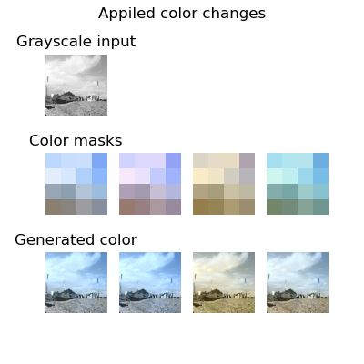

# Grayscale Image Colorization

This was a one of my independent ML projects in 2024. I revised the code to improve readability and performance. In the revised version, I trained the models on my own photographs taken between 2023 - 2025 in Japan France, Belgium, Netherlands, and Germany, as I went to internship abroad. 

## Contents
- [Overview](#Overview)
- [Data Preparation](#Data-Preparation)
- [Model Architecture]()
- [Model Parameters]()
- [Training Loss and Colorization Results]()
- [Test Results]()

## Overview
The idea is to use color masks to guide the model in colorizing grayscale images. With this approach, the model can learn to select appropriate colors based on real image attributes such as object appearance, season, and lighting conditions. The color masks for training data are generated by dividing each image into `n_cell × n_cell` grids and computing representative color values—such as the mean or median—for each cell. By selecting color masks, the model can produce various colorized images from one grayscale input.
**Results**

## Data Preparation
1. I used OpenCV for data preparation. Each image was resized so that its shorter edge became 96px, and cropped out in the center.
2. All images are converted into L\*a\*b color space. Every pixel values are standardized into 0 and 1.
3. Each image's color mask is generated by dividing image into `n_cell × n_cell` grids and computing median of each grid.